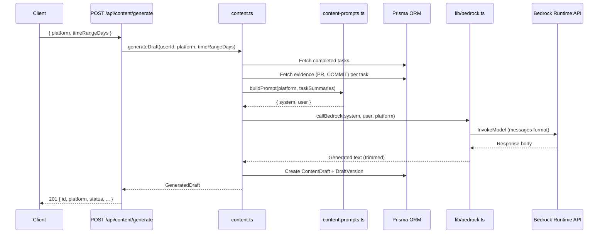
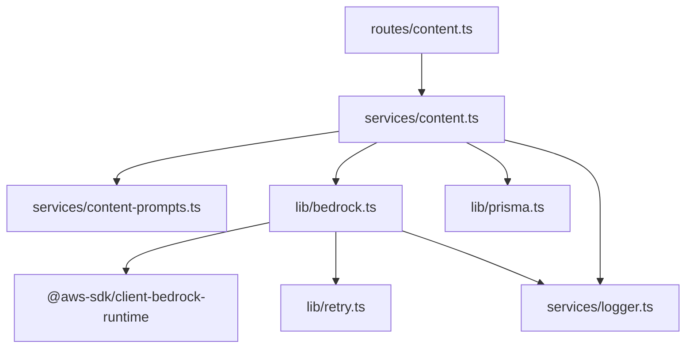

# Design Document: Bedrock Content Generation

## Overview

This design replaces the existing OpenAI-based `callLLM` function with an Amazon Bedrock integration using the `@aws-sdk/client-bedrock-runtime` SDK. The architecture introduces a singleton Bedrock client module, a new `callBedrock` function with platform-aware token limits, evidence context enrichment in the prompt builder, and structured error classification with retry logic for transient failures.

The integration authenticates via the ECS task role (no API keys), supports a template fallback for local development, and preserves the existing content draft lifecycle unchanged.

### Key Design Decisions

1. **Singleton client pattern** — The Bedrock Runtime client is instantiated once at module load and reused across requests to avoid per-request initialization overhead.
2. **Environment-driven feature flag** — `BEDROCK_ENABLED=false` disables Bedrock entirely for local dev without touching code paths.
3. **Evidence enrichment at prompt build time** — PR descriptions and commit messages are fetched and injected into the user prompt before calling the model, keeping the Bedrock client module unaware of business context.
4. **Error classification at the SDK boundary** — Bedrock errors are classified into throttling/model-unavailable/validation/other categories immediately upon catch, then mapped to `AppError` factories.
5. **Existing retry utility reuse** — The `withRetry` function from `src/lib/retry.ts` handles exponential backoff for throttling errors, avoiding a custom retry implementation.

## Architecture



### Module Dependency Graph



## Components and Interfaces

### 1. Bedrock Client Module (`packages/api/src/lib/bedrock.ts`)

Singleton module that encapsulates all Bedrock Runtime SDK interaction.

```typescript
/** Configuration read once at module load */
export interface BedrockConfig {
  modelId: string;       // from BEDROCK_MODEL_ID or default
  region: string;        // from BEDROCK_REGION or default
  enabled: boolean;      // from BEDROCK_ENABLED
}

/** Platform-specific inference parameters */
export interface InferenceParams {
  temperature: number;
  maxTokens: number;
}

/** Token limits per platform */
export const PLATFORM_MAX_TOKENS: Record<Platform, number> = {
  TWITTER: 300,
  LINKEDIN: 1024,
  BLOG: 2048,
};

/**
 * Invokes the configured Bedrock foundation model.
 * Handles error classification and delegates retry to withRetry for throttling.
 *
 * @throws AppError with appropriate code based on error classification
 */
export async function callBedrock(
  systemPrompt: string,
  userPrompt: string,
  platform: Platform,
): Promise<string>;

/**
 * Returns whether Bedrock is enabled based on config.
 * Used by content service to decide between Bedrock and template fallback.
 */
export function isBedrockEnabled(): boolean;

/**
 * Returns the loaded config (for logging/diagnostics, never exposes credentials).
 */
export function getBedrockConfig(): BedrockConfig;
```

**Initialization behavior:**
- Reads `BEDROCK_MODEL_ID`, `BEDROCK_REGION`, `BEDROCK_ENABLED` from `process.env` at module load
- Creates a `BedrockRuntimeClient` singleton with the resolved region
- If `BEDROCK_ENABLED` is `"false"` (case-insensitive), marks as disabled and skips client creation
- If `BEDROCK_ENABLED` is unset, attempts client creation; catches credential errors gracefully

### 2. Enhanced Prompt Builder (`packages/api/src/services/content-prompts.ts`)

Extended `TaskSummary` interface and `buildPrompt` function:

```typescript
/** Evidence item extracted from the database */
export interface EvidenceItem {
  type: 'PR' | 'COMMIT';
  content: string;  // PR description or commit message (already truncated)
}

/** Enhanced task summary with evidence context */
export interface TaskSummary {
  title: string;
  completedAt: Date;
  evidence?: string;           // Existing field (backward compat)
  evidenceItems?: EvidenceItem[]; // New: structured evidence from DB
}
```

The `buildPrompt` function is updated to render `evidenceItems` under each task entry:

```
- Task title [completed 2024-01-15]
  PR: Added pagination support to user list endpoint...
  PR: Fixed memory leak in connection pool...
  Commit: refactor: extract retry logic into shared util
  Commit: feat: add rate limiting middleware
```

### 3. Content Service Updates (`packages/api/src/services/content.ts`)

The `generateDraft` function is updated to:

1. Fetch evidence records per task (max 10, ordered by `fetchedAt` desc, types PR and COMMIT only)
2. Build enriched `TaskSummary` objects with truncated evidence content
3. Call `callBedrock` instead of `callLLM` (or template fallback when disabled)
4. Handle the fallback path when Bedrock is unavailable

```typescript
/**
 * Updated generateDraft flow:
 * 1. Fetch completed tasks (unchanged)
 * 2. Fetch evidence for each task (NEW)
 * 3. Build enriched prompts (UPDATED)
 * 4. Call Bedrock or fallback (UPDATED)
 * 5. Persist draft + version (unchanged)
 */
export async function generateDraft(
  userId: string,
  platform: ContentPlatform,
  timeRangeDays?: number,
): Promise<GeneratedDraft>;
```

### 4. Error Classification Logic

Error classification happens in `lib/bedrock.ts` immediately after catching SDK errors:

```typescript
type BedrockErrorClass = 'throttling' | 'model_unavailable' | 'validation' | 'other';

function classifyBedrockError(error: unknown): BedrockErrorClass {
  // Checks error.name against known Bedrock exception names
  // ThrottlingException, TooManyRequestsException → 'throttling'
  // ModelNotReadyException, ModelTimeoutException → 'model_unavailable'
  // ValidationException → 'validation'
  // Everything else → 'other'
}
```

### 5. IAM Policy Addition

A new inline policy statement added to the ECS task role:

```json
{
  "Sid": "BedrockInvokeModel",
  "Effect": "Allow",
  "Action": "bedrock:InvokeModel",
  "Resource": "arn:aws:bedrock:us-east-1::foundation-model/*"
}
```

## Data Models

### Existing Models (No Schema Changes)

The integration requires **no Prisma schema changes**. All models are reused as-is:

| Model | Usage in This Feature |
|-------|----------------------|
| `Task` | Source of completed tasks for content generation |
| `Evidence` | Source of PR descriptions and commit messages (via `metadata` JSON field) |
| `ContentDraft` | Stores generated drafts (unchanged lifecycle) |
| `DraftVersion` | Stores version history (unchanged) |
| `SystemLog` | Stores Bedrock invocation failure logs |

### Evidence Metadata Structure

The `Evidence.metadata` JSON field contains different shapes per type:

**For `type: PR`:**
```json
{
  "description": "Added pagination support with cursor-based navigation...",
  "title": "feat: add pagination",
  "number": 42,
  "state": "merged"
}
```

**For `type: COMMIT`:**
```json
{
  "message": "refactor: extract retry logic into shared utility",
  "sha": "abc123def"
}
```

### Environment Variables

| Variable | Default | Description |
|----------|---------|-------------|
| `BEDROCK_MODEL_ID` | `amazon.nova-pro-v1:0` | Foundation model to invoke |
| `BEDROCK_REGION` | `us-east-1` | AWS region for Bedrock client |
| `BEDROCK_ENABLED` | _(unset = auto-detect)_ | `false` disables Bedrock; `true` requires it; unset = try with fallback |


## Correctness Properties

*A property is a characteristic or behavior that should hold true across all valid executions of a system — essentially, a formal statement about what the system should do. Properties serve as the bridge between human-readable specifications and machine-verifiable correctness guarantees.*

### Property 1: Request body construction preserves prompts and applies platform-specific parameters

*For any* valid platform (TWITTER, LINKEDIN, BLOG) and any pair of non-empty system/user prompt strings, the constructed InvokeModel request body SHALL contain both prompts in the messages-format structure AND set temperature to 0.7 AND set maxTokens to the platform-specific limit (300 for TWITTER, 1024 for LINKEDIN, 2048 for BLOG).

**Validates: Requirements 1.1, 1.5**

### Property 2: Response extraction always returns trimmed content

*For any* Bedrock response body containing non-empty text content (possibly surrounded by whitespace, newlines, or other padding), the extraction logic SHALL return a string equal to the content with leading and trailing whitespace removed, and SHALL never return content from a previous invocation.

**Validates: Requirements 1.3**

### Property 3: Configuration resolution uses environment values with correct defaults

*For any* non-empty string value set as `BEDROCK_MODEL_ID`, that exact value SHALL be used as the model ID in API calls. *For any* empty or unset `BEDROCK_MODEL_ID`, the value `amazon.nova-pro-v1:0` SHALL be used. *For any* non-empty string value set as `BEDROCK_REGION`, that exact value SHALL be used as the client region. *For any* empty or unset `BEDROCK_REGION`, the value `us-east-1` SHALL be used.

**Validates: Requirements 2.1, 2.2, 2.3, 2.4**

### Property 4: Feature flag disables Bedrock for all case variations of "false"

*For any* case variation of the string "false" (e.g., "false", "False", "FALSE", "fAlSe") set as `BEDROCK_ENABLED`, the content service SHALL use the template fallback path and SHALL NOT attempt to invoke the Bedrock client.

**Validates: Requirements 3.1**

### Property 5: Template fallback output contains required structural elements

*For any* user prompt string, the template fallback output SHALL contain: an emoji character on the first line, a descriptive intro line, the user prompt content verbatim, and trailing hashtags including `#buildinpublic`.

**Validates: Requirements 3.4**

### Property 6: Evidence items appear in built prompt for completed tasks

*For any* task with associated PR evidence records containing a `description` field, those descriptions (truncated) SHALL appear in the built user prompt. *For any* task with associated COMMIT evidence records containing a `message` field, those messages (truncated) SHALL appear in the built user prompt.

**Validates: Requirements 4.1, 4.2**

### Property 7: Evidence count is capped at 10 per task

*For any* task with N evidence records where N > 10, the prompt builder SHALL include exactly 10 evidence items, selected as the 10 most recent by `fetchedAt`.

**Validates: Requirements 4.3**

### Property 8: Evidence content is truncated to platform-safe limits

*For any* PR description of length L > 500, the included description in the prompt SHALL be at most 500 characters. *For any* commit message of length L > 200, the included message in the prompt SHALL be at most 200 characters.

**Validates: Requirements 4.5**

### Property 9: Malformed evidence metadata is skipped without affecting other records

*For any* evidence record whose `metadata` JSON field does not contain the expected key (`description` for PR, `message` for COMMIT), that record SHALL be excluded from the prompt AND all other valid evidence records for the same task SHALL still be included.

**Validates: Requirements 4.6**

### Property 10: Failure logs never contain prompt content or access tokens

*For any* Bedrock invocation failure with any error type, the logged details SHALL include category "content", action "bedrock_invocation_failed", error type, model ID, and platform, but SHALL NOT contain any substring of the system prompt, user prompt, or any string matching an access token pattern.

**Validates: Requirements 5.5**

## Error Handling

### Error Classification Strategy

Bedrock SDK errors are classified immediately at the catch boundary in `lib/bedrock.ts`:

| Error Name(s) | Classification | Action | AppError Factory |
|--------------|----------------|--------|-----------------|
| `ThrottlingException`, `TooManyRequestsException` | Throttling | Retry with `withRetry` (3 attempts, 1000ms base, factor 2) | `serviceUnavailable` (after exhaustion) |
| `ModelNotReadyException`, `ModelTimeoutException` | Model Unavailable | No retry, immediate error | `serviceUnavailable` |
| `ValidationException` | Validation | No retry, immediate error | `badRequest` |
| `AccessDeniedException` | Permission | No retry, immediate error | `serviceUnavailable` |
| All others (`InternalServerException`, unknown) | Other | No retry, immediate error | `internalError` |

### Error Flow

```mermaid
flowchart TD
    A[Bedrock SDK throws] --> B{Classify error}
    B -->|Throttling| C[withRetry - max 3 attempts]
    C -->|Success on retry| D[Return content]
    C -->|All retries exhausted| E[serviceUnavailable - retryable: true]
    B -->|Model Unavailable| F[serviceUnavailable - retryable: true]
    B -->|Validation| G[badRequest - retryable: false]
    B -->|Permission| H[serviceUnavailable - retryable: false]
    B -->|Other| I[internalError - retryable: true]
    
    E --> J[Log failure]
    F --> J
    G --> J
    H --> J
    I --> J
```



### Fallback Behavior

When Bedrock is disabled or unavailable:

1. **`BEDROCK_ENABLED=false`** — Template fallback used immediately, no Bedrock client created
2. **Credentials error during invocation** — Fall back to template, log warning with `category: 'content'`, `action: 'bedrock_credentials_error'`
3. **Client initialization failure (BEDROCK_ENABLED unset)** — Fall back to template, log warning with `action: 'bedrock_fallback'`

### Error Response Format

All errors returned to clients follow the existing `AppError` structure:

```json
{
  "error": {
    "code": "SERVICE_UNAVAILABLE",
    "message": "Content generation temporarily unavailable. Please try again later.",
    "retryable": true
  }
}
```

Provider-specific details (Bedrock, model IDs, AWS internals) are never exposed in client-facing error messages.

## Testing Strategy

### Property-Based Tests (fast-check)

Property-based tests validate universal correctness properties across randomly generated inputs. Each test runs a minimum of 100 iterations.

| Property | Test File | What's Generated |
|----------|-----------|-----------------|
| 1: Request body construction | `bedrock-request-body-property.test.ts` | Random platform values, random prompt strings |
| 2: Response extraction | `bedrock-response-extraction-property.test.ts` | Random strings with varying whitespace padding |
| 3: Config resolution | `bedrock-config-property.test.ts` | Random env var values including empty/undefined |
| 4: Feature flag | `bedrock-feature-flag-property.test.ts` | Random case variations of "false" |
| 5: Template fallback | `bedrock-template-fallback-property.test.ts` | Random user prompt strings |
| 6: Evidence in prompt | `bedrock-evidence-prompt-property.test.ts` | Random tasks with random evidence items |
| 7: Evidence cap | `bedrock-evidence-cap-property.test.ts` | Tasks with 1–50 evidence records |
| 8: Truncation | `bedrock-truncation-property.test.ts` | Strings of varying lengths (0–5000 chars) |
| 9: Malformed metadata | `bedrock-malformed-evidence-property.test.ts` | Evidence records with random JSON shapes |
| 10: Log safety | `bedrock-log-safety-property.test.ts` | Random errors with random prompt content |

**Library:** `fast-check` (already used in the project)
**Configuration:** Minimum 100 iterations per property (`numRuns: 100`)
**Tag format:** `// Feature: bedrock-content-generation, Property {N}: {title}`

### Unit Tests (Example-Based)

| Scenario | What's Verified |
|----------|----------------|
| Throttling → retry → success | Retry invoked, content returned |
| Throttling → 3 failures → service-unavailable | Error after exhaustion |
| ModelNotReadyException → immediate error | No retry attempted |
| ValidationException → bad-request | Correct error factory used |
| AccessDeniedException → service-unavailable | Correct error mapping |
| Unknown exception → internal-error | Catch-all behavior |
| Credentials error → fallback + log | Template used, log written |
| BEDROCK_ENABLED=true → Bedrock path | No fallback |
| Empty response body → error | Proper error raised |

### Integration Tests

| Scenario | What's Verified |
|----------|----------------|
| POST /api/content/generate → 201 | Full request/response shape preserved |
| POST /api/content/generate with Bedrock failure → error response | Error shape with retryable flag |
| Evidence enrichment end-to-end | Tasks with evidence produce richer prompts |

### Test Approach Summary

- **Property tests** cover universal invariants (prompt construction, config resolution, truncation, evidence handling, error logging safety)
- **Unit tests** cover specific error scenarios and integration points
- **Integration tests** cover HTTP contract and end-to-end flows
- Mock the Bedrock SDK in all tests — never make real AWS calls in CI
