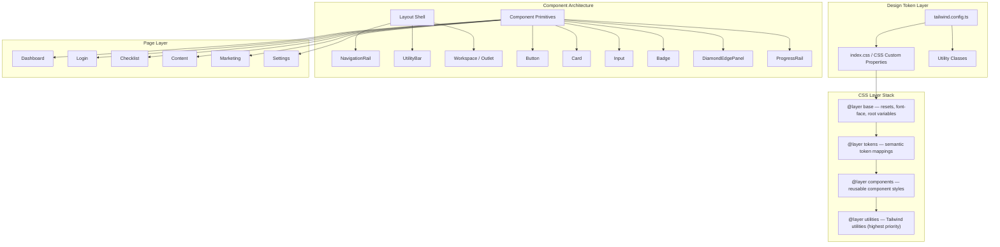
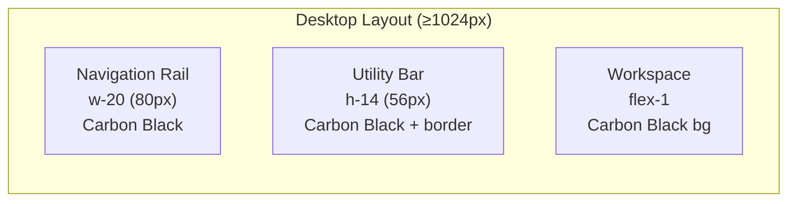

# Design Document: LaunchChrome Design System Migration

## Overview

This design describes the technical migration of the FounderLaunch_OS frontend from its current generic light-mode Tailwind styling to the LaunchChrome™ design language. The migration transforms the Tailwind configuration, CSS architecture, font loading, layout structure, component primitives, motion utilities, and all existing pages — without changing any application logic or API interactions.

The approach is token-first: all visual decisions flow from a centralized Tailwind theme extension that defines the full LaunchChrome™ vocabulary. Components consume these tokens exclusively, enabling consistent enforcement of the dark-only, chrome-accented, energy-colored identity across the entire application.

**Key design decisions:**
- CSS custom properties provide runtime token access for non-Tailwind contexts (keyframes, pseudo-elements, third-party integrations)
- CSS layers (`@layer`) establish specificity ordering between base resets, tokens, components, and utilities
- Fonts are self-hosted with `font-display: swap` and `<link rel="preload">` for zero layout shift
- Layout uses CSS Grid with named areas for navigation rail, utility bar, and workspace
- Motion is utility-class-driven with automatic `prefers-reduced-motion` suppression
- Migration proceeds page-by-page with existing functionality preserved via unchanged component interfaces

## Architecture



## Components and Interfaces

### 1. Tailwind Configuration (`packages/web/tailwind.config.ts`)

The Tailwind config is the single source of truth for all design tokens.

```typescript
// packages/web/tailwind.config.ts
import type { Config } from 'tailwindcss';

const config: Config = {
  content: ['./index.html', './src/**/*.{js,ts,jsx,tsx}'],
  theme: {
    extend: {
      colors: {
        // Foundation
        obsidian: '#050608',
        carbon: '#0B0D10',
        gunmetal: '#15191F',
        graphite: '#232933',
        // Chrome
        'chrome-white': '#F8FAFC',
        'chrome-silver': '#D7DCE3',
        'chrome-steel': '#929AA6',
        'dark-chrome': '#3B424C',
        // Energy
        'founder-pink': '#FF2BA6',
        'neon-magenta': '#FF4FC3',
        'launch-lime': '#B7FF2A',
        'electric-lime': '#D5FF65',
        // Supporting
        'hyper-cyan': '#42E8FF',
        'plasma-violet': '#9D63FF',
        'alert-red': '#FF4D5F',
        'warning-amber': '#FFB547',
        'victory-gold': '#FFD36A',
        // Text
        'text-primary': '#F7F9FC',
        'text-secondary': '#B7BEC9',
        'text-muted': '#7C8491',
        'text-disabled': '#555D68',
      },
      fontFamily: {
        interface: ['Inter', 'system-ui', 'sans-serif'],
        display: ['Space Grotesk', 'system-ui', 'sans-serif'],
      },
      fontSize: {
        'display-xl': ['72px', { lineHeight: '1.1', fontWeight: '800' }],
        'display-l': ['56px', { lineHeight: '1.15', fontWeight: '800' }],
        'h1': ['42px', { lineHeight: '1.2', fontWeight: '700' }],
        'h2': ['34px', { lineHeight: '1.25', fontWeight: '700' }],
        'h3': ['28px', { lineHeight: '1.3', fontWeight: '700' }],
        'h4': ['22px', { lineHeight: '1.35', fontWeight: '600' }],
        'body-l': ['18px', { lineHeight: '1.6', fontWeight: '400' }],
        'body': ['16px', { lineHeight: '1.6', fontWeight: '400' }],
        'small': ['14px', { lineHeight: '1.5', fontWeight: '400' }],
        'caption': ['12px', { lineHeight: '1.4', fontWeight: '500' }],
      },
      spacing: {
        '1': '4px',
        '2': '8px',
        '3': '12px',
        '4': '16px',
        '5': '20px',
        '6': '24px',
        '8': '32px',
        '12': '48px',
        '16': '64px',
        '24': '96px',
      },
      screens: {
        'sm': '640px',
        'md': '768px',
        'lg': '1024px',
        'xl': '1280px',
        '2xl': '1536px',
      },
      maxWidth: {
        'content': '1440px',
        'comfortable': '1280px',
      },
      transitionDuration: {
        'instant': '80ms',
        'fast': '140ms',
        'standard': '220ms',
        'slow': '360ms',
        'cinematic': '700ms',
      },
      transitionTimingFunction: {
        'enter': 'cubic-bezier(0.16, 1, 0.3, 1)',
        'exit': 'cubic-bezier(0.7, 0, 0.84, 0)',
        'snap': 'cubic-bezier(0.2, 0.8, 0.2, 1)',
        'ignition': 'cubic-bezier(0.1, 0.9, 0.2, 1)',
      },
      boxShadow: {
        'glow-pink': '0 0 20px rgba(255, 43, 166, 0.3)',
        'glow-lime': '0 0 20px rgba(183, 255, 42, 0.3)',
        'glow-cyan': '0 0 20px rgba(66, 232, 255, 0.3)',
        'chrome-edge': '0 1px 0 rgba(248, 250, 252, 0.08), inset 0 1px 0 rgba(248, 250, 252, 0.04)',
        'panel': '0 4px 24px rgba(0, 0, 0, 0.5), 0 1px 4px rgba(0, 0, 0, 0.3)',
      },
      keyframes: {
        'chrome-sweep': {
          '0%': { transform: 'translateX(-200%) rotate(18deg)' },
          '100%': { transform: 'translateX(400%) rotate(18deg)' },
        },
        'pulse-pink': {
          '0%, 100%': { opacity: '1' },
          '50%': { opacity: '0.6' },
        },
        'charge': {
          '0%': { width: '0%' },
          '100%': { width: 'var(--charge-target, 100%)' },
        },
      },
      animation: {
        'chrome-sweep': 'chrome-sweep 700ms var(--fl-ease-enter) forwards',
        'pulse-pink': 'pulse-pink 1.5s ease-in-out infinite',
        'charge': 'charge 600ms var(--fl-ease-ignition) forwards',
      },
    },
  },
  plugins: [],
};

export default config;
```

### 2. CSS Architecture (`packages/web/src/index.css`)

```css
/* Layer ordering — defines specificity cascade */
@layer base, tokens, components, utilities;

@layer base {
  @font-face {
    font-family: 'Inter';
    font-style: normal;
    font-weight: 400 800;
    font-display: swap;
    src: url('/fonts/Inter-Variable.woff2') format('woff2');
  }

  @font-face {
    font-family: 'Space Grotesk';
    font-style: normal;
    font-weight: 400 800;
    font-display: swap;
    src: url('/fonts/SpaceGrotesk-Variable.woff2') format('woff2');
  }

  *,
  *::before,
  *::after {
    box-sizing: border-box;
  }

  html {
    font-family: 'Inter', system-ui, sans-serif;
    font-feature-settings: 'tnum' on, 'lnum' on;
    -webkit-font-smoothing: antialiased;
    -moz-osx-font-smoothing: grayscale;
  }

  body {
    margin: 0;
    background-color: var(--fl-obsidian);
    color: var(--fl-text-primary);
  }
}

@layer tokens {
  :root {
    /* Foundation */
    --fl-obsidian: #050608;
    --fl-carbon: #0B0D10;
    --fl-gunmetal: #15191F;
    --fl-graphite: #232933;

    /* Chrome */
    --fl-chrome-white: #F8FAFC;
    --fl-chrome-silver: #D7DCE3;
    --fl-chrome-steel: #929AA6;
    --fl-dark-chrome: #3B424C;

    /* Energy */
    --fl-founder-pink: #FF2BA6;
    --fl-neon-magenta: #FF4FC3;
    --fl-launch-lime: #B7FF2A;
    --fl-electric-lime: #D5FF65;

    /* Supporting */
    --fl-hyper-cyan: #42E8FF;
    --fl-plasma-violet: #9D63FF;
    --fl-alert-red: #FF4D5F;
    --fl-warning-amber: #FFB547;
    --fl-victory-gold: #FFD36A;

    /* Text */
    --fl-text-primary: #F7F9FC;
    --fl-text-secondary: #B7BEC9;
    --fl-text-muted: #7C8491;
    --fl-text-disabled: #555D68;

    /* Motion */
    --fl-ease-enter: cubic-bezier(0.16, 1, 0.3, 1);
    --fl-ease-exit: cubic-bezier(0.7, 0, 0.84, 0);
    --fl-ease-snap: cubic-bezier(0.2, 0.8, 0.2, 1);
    --fl-ease-ignition: cubic-bezier(0.1, 0.9, 0.2, 1);
    --fl-duration-instant: 80ms;
    --fl-duration-fast: 140ms;
    --fl-duration-standard: 220ms;
    --fl-duration-slow: 360ms;
    --fl-duration-cinematic: 700ms;
  }
}

@layer components {
  /* Component-level styles defined here or in component CSS modules */
}

@layer utilities {
  /* Tailwind utilities injected here */
}

/* Reduced motion — system-level override */
@media (prefers-reduced-motion: reduce) {
  *,
  *::before,
  *::after {
    animation-duration: 0ms !important;
    animation-iteration-count: 1 !important;
    transition-duration: 0ms !important;
    scroll-behavior: auto !important;
  }
}

@tailwind base;
@tailwind components;
@tailwind utilities;
```

### 3. Font Loading Strategy

**Approach:** Self-hosted variable fonts with preload hints.

```html
<!-- index.html <head> additions -->
<link rel="preload" href="/fonts/Inter-Variable.woff2" as="font" type="font/woff2" crossorigin>
<link rel="preload" href="/fonts/SpaceGrotesk-Variable.woff2" as="font" type="font/woff2" crossorigin>
```

**File structure:**
```
packages/web/public/fonts/
├── Inter-Variable.woff2          (weights 400-800, ~95KB)
└── SpaceGrotesk-Variable.woff2   (weights 400-800, ~45KB)
```

Variable fonts are chosen because they provide all required weights (400, 500, 600, 700, 800) in a single file, reducing HTTP requests and total size compared to individual weight files.

**Fallback stack:** `system-ui, -apple-system, sans-serif` — ensures readable layout geometry during load.

### 4. Layout Component Architecture

The Layout component is restructured into a CSS Grid shell with three named areas:



**Component breakdown:**

| Component | File | Responsibility |
|-----------|------|----------------|
| `Layout` | `components/Layout.tsx` | Grid shell, responsive area switching |
| `NavigationRail` | `components/NavigationRail.tsx` | Route links, active state, brand mark |
| `UtilityBar` | `components/UtilityBar.tsx` | Sync indicator, user avatar, actions |
| `MobileNav` | `components/MobileNav.tsx` | Bottom tab bar for mobile viewports |

**Layout Grid (desktop):**
```css
.app-shell {
  display: grid;
  grid-template-columns: 80px 1fr;
  grid-template-rows: 56px 1fr;
  grid-template-areas:
    "nav utility"
    "nav workspace";
  min-height: 100vh;
}
```

**Layout Grid (mobile, <1024px):**
```css
.app-shell {
  display: grid;
  grid-template-columns: 1fr;
  grid-template-rows: 56px 1fr 64px;
  grid-template-areas:
    "utility"
    "workspace"
    "nav";
}
```

**NavigationRail interface:**
```typescript
interface NavItem {
  to: string;
  label: string;
  icon: React.ReactNode;  // SVG icon component
  end?: boolean;          // exact match for NavLink
}

// Props
interface NavigationRailProps {
  items: NavItem[];
}
```

Active state: Founder Pink left-edge indicator (3px wide), Gunmetal background highlight, Chrome White text. Hover state: Gunmetal background. Default: transparent background, text-muted color.

### 5. Reusable Component Primitives

All primitives live in `packages/web/src/components/ui/`.

#### Button

```typescript
interface ButtonProps extends React.ButtonHTMLAttributes<HTMLButtonElement> {
  variant: 'primary' | 'secondary' | 'tertiary' | 'danger';
  size?: 'sm' | 'md' | 'lg';
  loading?: boolean;
  icon?: React.ReactNode;
}
```

| Variant | Background | Text | Border | Glow |
|---------|-----------|------|--------|------|
| primary | founder-pink | chrome-white | founder-pink/20 | glow-pink |
| secondary | gunmetal | chrome-silver | graphite | none |
| tertiary | transparent | text-secondary | none | none |
| danger | alert-red/10 | alert-red | alert-red/30 | none |

All variants define: default, hover, active, focus (`ring-2 ring-hyper-cyan ring-offset-2 ring-offset-carbon`), disabled, loading states.

#### Card

```typescript
interface CardProps {
  children: React.ReactNode;
  variant?: 'default' | 'featured' | 'elevated';
  accent?: 'pink' | 'lime' | 'cyan' | 'red' | 'amber';
  className?: string;
}
```

- `default`: `bg-gunmetal border border-graphite`
- `featured`: `bg-gunmetal border border-graphite shadow-panel` + accent left-border
- `elevated`: `bg-graphite border border-dark-chrome`

#### Input

```typescript
interface InputProps extends React.InputHTMLAttributes<HTMLInputElement> {
  label: string;
  error?: string;
  hint?: string;
}
```

Styles: `bg-carbon border border-graphite text-text-primary placeholder:text-text-muted focus:border-hyper-cyan focus:ring-1 focus:ring-hyper-cyan`

#### Badge

```typescript
interface BadgeProps {
  children: React.ReactNode;
  color: 'lime' | 'pink' | 'cyan' | 'red' | 'amber' | 'gold' | 'chrome';
}
```

Each color maps to the semantic Energy color with a low-opacity background and solid text.

#### DiamondEdgePanel

```typescript
interface DiamondEdgePanelProps {
  children: React.ReactNode;
  className?: string;
}
```

The signature component uses:
- `bg-carbon` body
- Chrome border frame (1px `chrome-steel` outer, 1px inner highlight)
- CSS `clip-path` for angular corners
- Left-edge Launch Lime glow (absolute-positioned gradient)
- Right-edge Founder Pink glow (absolute-positioned gradient)
- `shadow-panel` for depth

#### ProgressRail

```typescript
interface ProgressRailProps {
  value: number;       // 0-100
  label?: string;
  showPercentage?: boolean;
}
```

Track: `bg-graphite rounded-full`. Fill: `bg-launch-lime` with leading-edge glow. Animates on mount with `charge` keyframe (respects reduced-motion).

### 6. Motion Utilities

Motion is handled through Tailwind utility classes that automatically disable under reduced-motion:

```css
/* Utility classes added via Tailwind plugin or index.css */
.motion-safe\:transition-state {
  transition-property: transform, box-shadow, background-color, border-color, opacity;
  transition-duration: 140ms;
  transition-timing-function: cubic-bezier(0.2, 0.8, 0.2, 1);
}

.motion-safe\:transition-panel {
  transition-property: transform, opacity, filter;
  transition-duration: 220ms;
  transition-timing-function: cubic-bezier(0.16, 1, 0.3, 1);
}

.motion-safe\:hover-lift:hover {
  transform: translateY(-2px);
}

.motion-safe\:active-press:active {
  transform: translateY(1px) scale(0.985);
}
```

All motion classes use Tailwind's built-in `motion-safe:` variant, which is a no-op when `prefers-reduced-motion: reduce` is active.

### 7. Diamond Edge Panel Implementation

```css
.diamond-edge-panel {
  position: relative;
  background: var(--fl-carbon);
  border: 1px solid var(--fl-dark-chrome);
  clip-path: polygon(
    12px 0, calc(100% - 12px) 0,
    100% 12px, 100% calc(100% - 12px),
    calc(100% - 12px) 100%, 12px 100%,
    0 calc(100% - 12px), 0 12px
  );
}

.diamond-edge-panel::before {
  content: '';
  position: absolute;
  inset: 0;
  background: linear-gradient(
    135deg,
    rgba(183, 255, 42, 0.08) 0%,
    transparent 40%,
    transparent 60%,
    rgba(255, 43, 166, 0.08) 100%
  );
  pointer-events: none;
}
```

### 8. Responsive Grid System

The grid system uses Tailwind's responsive prefixes on a CSS Grid container:

```typescript
// Grid container component
interface GridProps {
  children: React.ReactNode;
  cols?: { mobile?: number; tablet?: number; desktop?: number };
  gap?: string;
}
```

Default column configuration:
- Mobile (< 640px): 4 columns, single-column content stacking
- Tablet (768px–1023px): 8 columns
- Desktop (≥ 1024px): 12 columns

Max content width: `1440px` centered with `mx-auto`.

Tailwind classes: `grid grid-cols-4 md:grid-cols-8 lg:grid-cols-12 gap-4 md:gap-6 max-w-content mx-auto`

### 9. Page Migration Strategy

Each page is migrated by replacing Tailwind class strings. The component interface (props, data flow, event handlers) remains identical.

| Page | Key Changes |
|------|-------------|
| **Dashboard** | `bg-gray-50` → `bg-carbon`, cards → `Card` component, progress bar → `ProgressRail`, blocker list → Card with `accent="red"`, next-action → `DiamondEdgePanel` with pink accent |
| **Login** | `bg-gray-50` → `bg-obsidian`, centered layout preserved, heading → `font-display text-chrome-white`, CTA → `Button variant="primary"` |
| **Checklist** | Category sections → `Card` with semantic badges, completed items use `launch-lime` indicators |
| **Content** | Draft cards → `Card` with status `Badge` components using Energy colors |
| **Marketing** | Asset cards → `Card`, status indicators → semantic `Badge` colors |
| **Settings** | Form inputs → `Input` component, section cards → `Card variant="elevated"` |

**Migration order (by dependency):**
1. Tailwind config + CSS foundation (tokens available everywhere)
2. Font files + `index.html` preload tags
3. Component primitives (`Button`, `Card`, `Input`, `Badge`, `ProgressRail`, `DiamondEdgePanel`)
4. Layout shell (`NavigationRail`, `UtilityBar`, `Layout` refactor)
5. Login page (standalone, no layout dependency)
6. Dashboard (highest visibility, exercises most components)
7. Remaining pages (Checklist, Content, Marketing, Settings)

### 10. Visual Polish Enhancements

These enhancements elevate the application from "correctly themed" to the cinematic, premium command-center feel mandated by the Master Bible. All use GPU-friendly `transform` and `opacity` properties and respect `prefers-reduced-motion`.

#### 10.1 Chrome Sweep Hover Effect

A narrow white reflection sweeps diagonally across featured surfaces on hover.

**Applied to:** DiamondEdgePanel, primary Button (hover), NavigationRail active item (on initial activation)

```css
.chrome-sweep {
  position: relative;
  overflow: hidden;
}

.chrome-sweep::after {
  content: '';
  position: absolute;
  inset: -20%;
  width: 24%;
  transform: translateX(-220%) rotate(18deg);
  background: linear-gradient(
    90deg,
    transparent,
    rgba(255, 255, 255, 0.12),
    transparent
  );
  pointer-events: none;
  transition: none;
}

.chrome-sweep:hover::after {
  animation: chrome-sweep 700ms var(--fl-ease-enter) forwards;
}

@media (prefers-reduced-motion: reduce) {
  .chrome-sweep:hover::after {
    animation: none;
  }
}
```

#### 10.2 Ambient Background Texture

The workspace area uses a subtle dual-neon radial bloom to create atmospheric depth behind content.

```css
.workspace-ambient {
  background:
    radial-gradient(
      ellipse 60% 50% at 10% 90%,
      rgba(183, 255, 42, 0.02) 0%,
      transparent 70%
    ),
    radial-gradient(
      ellipse 50% 60% at 90% 10%,
      rgba(255, 43, 166, 0.02) 0%,
      transparent 70%
    ),
    var(--fl-carbon);
}
```

The bloom is at 2% opacity — perceptible as depth but never interferes with content readability. On mobile, reduce to a single gradient at 1.5% to preserve performance.

#### 10.3 NavigationRail Active Glow

The active navigation item gets a subtle pink glow in addition to the left-edge indicator, making it feel "powered on."

```css
.nav-item-active {
  background: var(--fl-gunmetal);
  border-left: 3px solid var(--fl-founder-pink);
  box-shadow: inset 0 0 12px rgba(255, 43, 166, 0.08),
              0 0 8px rgba(255, 43, 166, 0.05);
}
```

This is subtle enough to read as ambient light rather than a loud glow, maintaining the "controlled energy" principle.

#### 10.4 Metric Count-Up Animation

Numeric values on the Dashboard (launch readiness %, blocker count, total tasks) animate from 0 to their target value on first render.

**Implementation:** A `useCountUp` hook:

```typescript
interface UseCountUpOptions {
  end: number;
  duration?: number;  // default 400ms
  delay?: number;     // default 0ms
}

function useCountUp({ end, duration = 400, delay = 0 }: UseCountUpOptions): number {
  // Returns animated current value
  // Uses requestAnimationFrame with ease-out deceleration
  // Respects prefers-reduced-motion: returns `end` immediately when active
}
```

Duration: 400ms with deceleration easing. Only fires on initial mount (not on re-renders). Numbers display using `font-variant-numeric: tabular-nums` to prevent layout jitter during animation.

#### 10.5 Card Hover Micro-Interaction

All Card components receive a subtle lift and border brightening on hover.

```typescript
// Added to Card component className
const hoverClasses = 'motion-safe:transition-state motion-safe:hover:-translate-y-0.5 hover:border-dark-chrome/80 hover:shadow-chrome-edge';
```

- Lift: `translateY(-2px)` — perceptible but restrained
- Border: brightens from `graphite` to `dark-chrome` with partial opacity
- Shadow: adds `chrome-edge` shadow for a "catching light" effect
- Duration: 140ms with `ease-snap` — fast and controlled
- Reduced motion: no transform, only border color change

#### 10.6 Branded Skeleton Loading

Replace the current plain spinner with LaunchChrome™ skeleton loading for data-fetching states.

```typescript
interface SkeletonProps {
  variant: 'text' | 'card' | 'metric' | 'progress';
  lines?: number;  // for text variant
}
```

**Visual treatment:**
- Base: `bg-gunmetal rounded` (matches card surfaces)
- Chrome sweep: a moving highlight using the same `chrome-sweep` keyframe at 1800ms duration
- No white flash — highlight is a subtle `rgba(248, 250, 252, 0.04)` gradient

```css
.skeleton-shimmer {
  background: linear-gradient(
    90deg,
    var(--fl-gunmetal) 0%,
    rgba(248, 250, 252, 0.04) 50%,
    var(--fl-gunmetal) 100%
  );
  background-size: 200% 100%;
  animation: skeleton-sweep 1.8s ease-in-out infinite;
}

@keyframes skeleton-sweep {
  0% { background-position: 200% 0; }
  100% { background-position: -200% 0; }
}

@media (prefers-reduced-motion: reduce) {
  .skeleton-shimmer {
    animation: none;
    background: var(--fl-graphite);
  }
}
```

Under reduced-motion: static `graphite` tone difference (no moving sweep).

#### 10.7 Page Transition Crossfade

Route transitions use a subtle opacity crossfade for continuity between pages.

**Implementation:** Wrap the `<Outlet>` in a transition container:

```typescript
// In Layout.tsx workspace area
<div className="motion-safe:animate-fade-in">
  <Outlet />
</div>
```

```css
@keyframes fade-in {
  from {
    opacity: 0;
    transform: translateY(4px);
  }
  to {
    opacity: 1;
    transform: translateY(0);
  }
}

.animate-fade-in {
  animation: fade-in 220ms var(--fl-ease-enter) both;
}
```

Using React Router's `key` prop on the outlet wrapper triggers re-animation on route change. Duration: 220ms (standard token). The 4px upward movement gives a sense of content "deploying" into view.

Under reduced-motion: instant render, no animation.

## Data Models

This feature does not introduce new data models or API changes. All existing TypeScript interfaces for page data remain unchanged. The migration is purely visual — component props and data-fetching logic are preserved as-is.

The only new TypeScript types are component prop interfaces for the UI primitives (documented above in Components and Interfaces).


## Correctness Properties

*A property is a characteristic or behavior that should hold true across all valid executions of a system — essentially, a formal statement about what the system should do. Properties serve as the bridge between human-readable specifications and machine-verifiable correctness guarantees.*

### Property 1: Design token resolution completeness

*For any* design token name in the specification (across all categories: foundation colors, chrome colors, energy colors, supporting colors, text colors, typography scale entries, spacing values, and motion durations), the resolved value from the Tailwind configuration must exactly match the expected value defined in the Master Bible.

**Validates: Requirements 1.1, 1.2, 1.3, 1.4, 1.5, 1.6, 1.8, 1.9**

### Property 2: Dark-only surface invariant

*For any* component rendered with any valid props configuration, the computed background color must have a relative luminance below 0.05 (ensuring dark-only surfaces). No component may ever produce a white or light-colored background.

**Validates: Requirements 2.5, 2.6**

### Property 3: WCAG contrast compliance

*For any* pair of (text-color-token, surface-color-token) that may co-occur in the theme, the computed WCAG 2.2 contrast ratio must be at least 4.5:1 for normal text (below 18px or below 14px bold) and at least 3:1 for large text (18px+ or 14px+ bold). For any (border-color-token, adjacent-surface-token) pair on interactive controls, contrast must be at least 3:1.

**Validates: Requirements 3.7, 7.1, 7.2, 7.3**

### Property 4: Reduced motion suppression

*For any* animated element in the application, when `prefers-reduced-motion: reduce` is active, the effective animation-duration and transition-duration must resolve to 0ms (or only opacity transitions remain). No transform-based, scale-based, or translate-based animation shall execute under reduced-motion mode.

**Validates: Requirements 7.4, 8.5**

### Property 5: Card and panel surface correctness

*For any* Card component variant (default, featured, elevated) rendered with any valid props, the background class must resolve to a Foundation or Interactive surface token (gunmetal or graphite), and the border must resolve to a graphite or dark-chrome token.

**Validates: Requirements 2.3, 5.3**

### Property 6: Badge semantic color mapping

*For any* valid Badge color prop value, the rendered color classes must map to the correct semantic Energy color: 'lime' → Launch Lime, 'pink' → Founder Pink, 'cyan' → Hyper Cyan, 'red' → Alert Red, 'amber' → Warning Amber, 'gold' → Victory Gold.

**Validates: Requirements 5.5**

### Property 7: Non-color status communication

*For any* Badge or status indicator component rendered with any color prop, the output must include at least one non-color indicator (text label or supplementary icon) in addition to the color-coded visual treatment.

**Validates: Requirements 7.8**

### Property 8: Focus indicator visibility

*For any* interactive component (Button, Input, NavLink, toggle, select), when the component receives keyboard focus, a visible focus ring must be rendered with a minimum width of 2px and sufficient contrast against the adjacent surface (at least 3:1).

**Validates: Requirements 5.7, 7.5**

### Property 9: Touch target minimum size

*For any* interactive element (buttons, links, controls) rendered at a mobile viewport width (below 640px), the computed clickable area must be at least 44×44 CSS pixels.

**Validates: Requirements 7.6**

## Error Handling

This migration introduces no new runtime error conditions since it only changes visual presentation. Existing error handling patterns are preserved:

| Scenario | Handling |
|----------|----------|
| Font load failure | `font-display: swap` ensures text renders immediately with system fallback. No FOIT. |
| CSS custom property unsupported | Tailwind utility classes provide direct values as fallback; CSS vars are progressive enhancement. |
| `prefers-reduced-motion` unsupported | Motion plays normally (graceful degradation — older browsers get the full experience). |
| Tailwind config parse error | Build fails at compile time; caught during `npm run build` before deployment. |
| Missing token reference | TypeScript type safety on component props prevents invalid token usage at compile time. |

All existing page-level error states (API errors, loading failures, empty states) preserve their current behavior but render with LaunchChrome™ styling (Alert Red accent, dark surfaces, recovery CTAs).

## Testing Strategy

### Property-Based Tests (fast-check)

Property-based testing is appropriate for this feature because:
- The token system has clear input/output relationships (token name → resolved value)
- Color contrast is a pure mathematical computation over a large input space (all color pairs)
- Component rendering invariants (dark-only, semantic mapping) hold universally across all prop combinations

**Library:** `fast-check` (already in devDependencies)
**Minimum iterations:** 100 per property test
**Tag format:** `Feature: launchchrome-design-system, Property {N}: {title}`

Each correctness property maps to a single property-based test:

1. **Token resolution** — Generate random token names from the full specification set, resolve via Tailwind config, assert exact match
2. **Dark-only invariant** — Generate random component + props combinations, compute background luminance, assert < 0.05
3. **Contrast compliance** — Generate all valid (foreground, background) pairs, compute WCAG ratio, assert thresholds
4. **Reduced motion** — Generate random motion utility class combinations, assert 0ms under reduced-motion
5. **Card surface correctness** — Generate random Card variant + props, assert background resolves to correct Foundation token
6. **Badge color mapping** — Generate random valid badge color props, assert output maps to correct Energy color
7. **Non-color status** — Generate random Badge/status renders, assert text label or icon accompanies color
8. **Focus indicator** — Generate random interactive components, simulate focus, assert ring presence and width
9. **Touch target size** — Generate random interactive components at mobile viewport, assert min 44×44px

### Unit Tests (example-based)

| Area | Tests |
|------|-------|
| Layout structure | NavigationRail renders at desktop, hides at mobile; UtilityBar renders; workspace renders |
| Button variants | Each variant renders correct classes for all states |
| Input component | Focus state adds cyan ring; error state adds red border |
| DiamondEdgePanel | Clip-path applied; edge gradients render |
| Login page | Obsidian bg, centered form, pink CTA |
| Dashboard page | Carbon bg, progress uses lime, blockers use red |
| Font loading | Preload links present in HTML; font-face declarations correct |
| Semantic HTML | Layout uses nav, main, aside, header elements |

### Integration Tests

| Area | Tests |
|------|-------|
| Route preservation | All routes resolve to correct pages post-migration |
| Data flow | Dashboard fetches and renders data identically |
| Auth flow | Login redirect, session, logout all work unchanged |
| Code splitting | Lazy-loaded routes produce separate chunks |

### Visual Regression (recommended, not PBT)

Snapshot tests for each page at mobile (375px), tablet (768px), and desktop (1280px) viewports to catch unintended visual regressions during iterative migration.
