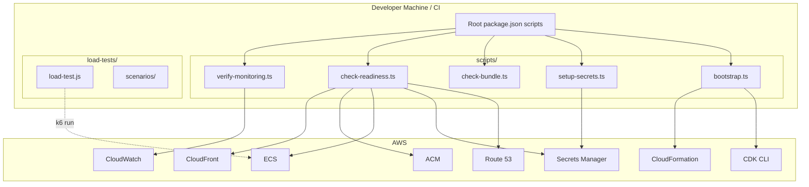

# Design Document: Production Deployment Readiness

## Overview

This design covers the operational readiness tooling required to take Solo Founder Launch OS from "infrastructure code complete" to "production live." The production CDK stacks, CI/CD workflows, Docker configuration, and monitoring are already built. What remains are the bootstrapping scripts, verification tooling, and validation checks that ensure everything is correctly wired together before flipping the switch.

The deliverables are primarily CLI scripts (TypeScript, executed via `tsx`) that automate or verify operational readiness steps. They integrate with the existing monorepo structure via root `package.json` scripts and optionally run in CI.

### Key Design Decisions

| Decision | Choice | Rationale |
|----------|--------|-----------|
| Script Language | TypeScript (tsx) | Consistent with monorepo; type-safe; access to AWS SDK types |
| Script Location | `scripts/` at repo root | Separate from application code; shared across packages |
| Load Testing Tool | k6 | Open-source, scriptable in JS, excellent CLI reporting, handles ramp patterns natively |
| Bundle Analyzer | Custom script using Vite's `build` output | Lightweight; no extra dependency; reads `dist/.vite/manifest.json` + gzip measurement |
| Readiness Checklist | TypeScript script with pluggable checks | Extensible; outputs both human-readable and JSON; can run subset of checks |
| CLI Argument Parsing | `process.argv` manual parsing | Zero dependencies; these scripts have 1-2 flags each |

---

## Architecture

### Script Execution Architecture



### File Layout

```
solo-founder-launch-os/
├── scripts/
│   ├── bootstrap.ts            # CDK bootstrap + ordered stack deployment
│   ├── setup-secrets.ts        # Generate and store production secrets
│   ├── check-bundle.ts         # Frontend bundle size analysis
│   ├── check-readiness.ts      # Deployment readiness checklist
│   ├── verify-monitoring.ts    # Monitoring and alerting verification
│   └── lib/
│       ├── aws.ts              # Shared AWS SDK client factories
│       ├── checks.ts           # Readiness check definitions and types
│       ├── bundle-analyzer.ts  # Bundle analysis pure logic (testable)
│       └── reporter.ts         # Output formatting (human + JSON)
├── load-tests/
│   ├── load-test.js            # k6 main script
│   ├── config.json             # Target URLs, thresholds, scenarios
│   └── scenarios/
│       ├── ramp-up.js          # Gradual ramp to peak
│       ├── sustained.js        # Sustained peak load
│       └── spike.js            # Sudden traffic spike
├── docs/
│   └── deployment/
│       ├── dns-setup.md        # DNS configuration guide
│       ├── aws-account-setup.md # OIDC, IAM, GitHub secrets guide
│       ├── first-deployment.md  # Step-by-step first deployment runbook
│       └── manual-migration.md  # Fallback migration procedure
└── package.json                # Updated with new scripts
```

---

## Components and Interfaces

### 1. Bootstrap Script (`scripts/bootstrap.ts`)

Orchestrates the initial CDK deployment in the correct dependency order.

```typescript
// scripts/bootstrap.ts
interface BootstrapOptions {
  stage: 'staging' | 'production';
  skipBootstrap?: boolean;  // Skip cdk bootstrap if already done
  verbose?: boolean;
}

interface DeploymentResult {
  stackName: string;
  status: 'CREATE_COMPLETE' | 'UPDATE_COMPLETE';
  outputs: Record<string, string>;
  duration: number; // ms
}

interface BootstrapOutput {
  success: boolean;
  stacks: DeploymentResult[];
  resources: {
    albDnsName: string;
    cloudfrontDistributionId: string;
    ecrRepositoryUri: string;
    rdsEndpoint: string;
    ecsClusterArn: string;
  };
  smokeTest: { healthy: boolean; statusCode: number };
}

// CLI: npx tsx scripts/bootstrap.ts --stage production [--skip-bootstrap] [--verbose]
```

**Behavior:**
1. Parse `--stage` argument (required, validates `staging` | `production`)
2. Run `cdk bootstrap aws://{account}/{region}` unless `--skip-bootstrap`
3. Deploy stacks sequentially: `network` → `database` → `container` → `cdn` → `monitoring`
4. After each `cdk deploy`, poll CloudFormation until terminal status
5. On failure: print stack events with errors, suggest rollback command, exit 1
6. On success: extract outputs from CloudFormation, run ALB health check, print summary

### 2. Secrets Setup Script (`scripts/setup-secrets.ts`)

Generates cryptographic secrets and stores them in AWS Secrets Manager.

```typescript
// scripts/setup-secrets.ts
interface SecretsSetupOptions {
  stage: 'staging' | 'production';
  force?: boolean;  // Overwrite existing secrets
}

interface SecretDefinition {
  path: string;           // e.g., '/solo-founder-launch-os/production/session/secret'
  generate: boolean;      // true = auto-generate, false = manual (skip)
  description: string;
  generator?: () => string; // Custom generator function
}

// Secrets that are auto-generated
const AUTO_SECRETS: SecretDefinition[] = [
  {
    path: '/solo-founder-launch-os/{stage}/session/secret',
    generate: true,
    description: 'Express session secret (256-bit random)',
    generator: () => crypto.randomBytes(32).toString('hex'),
  },
  {
    path: '/solo-founder-launch-os/{stage}/encryption/key',
    generate: true,
    description: 'AES-256 encryption key',
    generator: () => crypto.randomBytes(32).toString('base64'),
  },
];

// Secrets that require manual input (script documents them)
const MANUAL_SECRETS = [
  '/solo-founder-launch-os/{stage}/github/client-id',
  '/solo-founder-launch-os/{stage}/github/client-secret',
  '/solo-founder-launch-os/{stage}/github/callback-url',
];

// CLI: npx tsx scripts/setup-secrets.ts --stage production [--force]
```

**Behavior:**
1. Check each auto-generate secret path in Secrets Manager
2. If exists and `--force` not set: skip with message "already exists, use --force to overwrite"
3. If not exists or `--force`: generate value, call `PutSecretValue`
4. Print list of manual secrets that need to be populated by the user
5. Run validation: check all paths exist and are non-empty

### 3. Bundle Analyzer (`scripts/check-bundle.ts` + `scripts/lib/bundle-analyzer.ts`)

Measures frontend bundle size against the 500KB gzipped threshold.

```typescript
// scripts/lib/bundle-analyzer.ts — Pure logic (testable)
interface ChunkInfo {
  name: string;
  type: 'main' | 'vendor' | 'css' | 'route';
  rawSize: number;       // bytes
  gzipSize: number;      // bytes
  isInitial: boolean;    // true = loaded on first page load
}

interface BundleAnalysisResult {
  chunks: ChunkInfo[];
  totalInitialRaw: number;
  totalInitialGzip: number;
  status: 'pass' | 'warn' | 'fail';
  threshold: number;         // 500 * 1024 (500KB in bytes)
  warningThreshold: number;  // 400 * 1024 (400KB in bytes)
  message: string;
}

function analyzeBundles(chunks: ChunkInfo[]): BundleAnalysisResult;

// scripts/lib/reporter.ts
interface ReportOptions {
  format: 'human' | 'json';
}

function formatBundleReport(result: BundleAnalysisResult, options: ReportOptions): string;

// CLI: npx tsx scripts/check-bundle.ts [--json]
// Exit code 0 = pass, exit code 1 = fail (exceeds 500KB)
```

**Behavior:**
1. Run `npm run build:web` (or read existing `packages/web/dist/`)
2. Read `.vite/manifest.json` to identify chunks
3. Measure gzipped size of each chunk using `zlib.gzipSync`
4. Classify chunks: main, vendor (from node_modules), CSS, route chunks
5. Sum initial chunks (non-lazy) for threshold comparison
6. Output formatted report with breakdown
7. Exit 0 (pass), exit 0 with warning (400-500KB), or exit 1 (> 500KB)

### 4. Readiness Checklist (`scripts/check-readiness.ts` + `scripts/lib/checks.ts`)

Runs all automated verification checks and produces a go/no-go recommendation.

```typescript
// scripts/lib/checks.ts
type CheckCategory = 
  | 'dns'
  | 'oidc'
  | 'stacks'
  | 'secrets'
  | 'database'
  | 'monitoring'
  | 'bundle'
  | 'tls';

interface CheckDefinition {
  id: string;
  name: string;
  category: CheckCategory;
  automated: boolean;       // true = script can verify; false = manual
  run?: () => Promise<CheckResult>;
}

interface CheckResult {
  id: string;
  name: string;
  category: CheckCategory;
  automated: boolean;
  status: 'pass' | 'fail' | 'skip';
  expected?: string;
  actual?: string;
  remediation?: string;
  durationMs: number;
}

interface ReadinessReport {
  timestamp: string;
  stage: string;
  checks: CheckResult[];
  automatedPassed: number;
  automatedFailed: number;
  automatedTotal: number;
  manualItems: string[];
  recommendation: 'go' | 'no-go';
}

function aggregateResults(checks: CheckResult[]): ReadinessReport;

// CLI: npx tsx scripts/check-readiness.ts --stage production [--json] [--category dns,secrets]
```

**Automated checks include:**
- DNS: resolve `api.solofounder.app` and `app.solofounder.app`
- OIDC: `aws sts get-caller-identity` with the deploy role
- Stacks: all 5 CloudFormation stacks in `CREATE_COMPLETE` or `UPDATE_COMPLETE`
- Secrets: all secret paths exist and are non-empty in Secrets Manager
- Database: ECS task can connect (or check RDS status)
- Monitoring: CloudWatch log group exists and has recent log events
- Bundle: run `check-bundle.ts` or check last CI result
- TLS: ACM certificates valid with > 30 days remaining
- ECS: at least 1 healthy task, ALB target healthy
- CloudFront: returns `index.html` with correct headers

**Manual items listed (not verified):**
- Email alert confirmation received
- GitHub OAuth app tested end-to-end
- Domain registration complete

### 5. Monitoring Verification (`scripts/verify-monitoring.ts`)

Verifies that monitoring infrastructure is functioning with real data.

```typescript
// scripts/verify-monitoring.ts
interface MonitoringVerification {
  logGroupReceiving: boolean;
  dashboardPopulated: boolean;
  testAlarmTriggered: boolean;
  metricFilterWorking: boolean;
  logsInsightsWorking: boolean;
}

// CLI: npx tsx scripts/verify-monitoring.ts --stage production
```

**Behavior:**
1. Check CloudWatch log group has events in the last 15 minutes
2. Put a test metric to trigger the error-rate alarm (temporarily)
3. Wait up to 5 minutes for SNS notification
4. Run a Logs Insights query and verify results returned
5. Report pass/fail for each check with troubleshooting if needed

### 6. Load Testing (`load-tests/`)

k6 load testing suite for validating auto-scaling behavior.

```javascript
// load-tests/config.json
{
  "baseUrl": "https://api.solofounder.app",
  "scenarios": {
    "rampUp": {
      "executor": "ramping-vus",
      "startVUs": 0,
      "stages": [
        { "duration": "5m", "target": 50 },
        { "duration": "10m", "target": 50 },
        { "duration": "3m", "target": 0 }
      ]
    }
  },
  "thresholds": {
    "http_req_duration": ["p(95)<2000"],
    "http_req_failed": ["rate<0.05"]
  }
}
```

```javascript
// load-tests/load-test.js (k6 script)
import http from 'k6/http';
import { check, sleep } from 'k6';
import { config } from './config.json';

export const options = {
  scenarios: config.scenarios,
  thresholds: config.thresholds,
};

export default function () {
  // Health check (lightweight)
  const healthRes = http.get(`${config.baseUrl}/health`);
  check(healthRes, { 'health 200': (r) => r.status === 200 });

  // Authenticated route simulation
  const dashRes = http.get(`${config.baseUrl}/api/dashboard`, {
    headers: { 'Cookie': `session=${__ENV.TEST_SESSION_COOKIE}` },
  });
  check(dashRes, { 'dashboard 200': (r) => r.status === 200 });

  sleep(1);
}
```

**Execution:**
```bash
# Run load test
k6 run load-tests/load-test.js --env TEST_SESSION_COOKIE=<value>

# Or via npm script
npm run test:load -- --env TEST_SESSION_COOKIE=<value>
```

---

## Data Models

No new database models. The scripts operate against AWS APIs and local build artifacts.

### Configuration Data

| Data | Location | Format |
|------|----------|--------|
| Environment config | `packages/infra/lib/config/environments.ts` | TypeScript |
| Load test config | `load-tests/config.json` | JSON |
| Bundle thresholds | `scripts/lib/bundle-analyzer.ts` constants | TypeScript |
| Check definitions | `scripts/lib/checks.ts` | TypeScript |

### Script Output Formats

All scripts support dual output:
- **Human-readable** (default): colored terminal output with tables/lists
- **JSON** (`--json` flag): machine-readable for CI integration

```typescript
// Example readiness JSON output
{
  "timestamp": "2024-01-15T10:30:00Z",
  "stage": "production",
  "recommendation": "no-go",
  "automatedPassed": 7,
  "automatedFailed": 1,
  "automatedTotal": 8,
  "checks": [
    {
      "id": "dns-api",
      "name": "API DNS resolution",
      "category": "dns",
      "status": "pass",
      "durationMs": 142
    },
    {
      "id": "tls-api",
      "name": "API TLS certificate validity",
      "category": "tls",
      "status": "fail",
      "expected": "> 30 days until expiration",
      "actual": "Certificate not found",
      "remediation": "Verify ACM certificate exists in us-east-1 and is validated. Check domain validation DNS records."
    }
  ],
  "manualItems": [
    "Confirm alarm notification email received",
    "Test GitHub OAuth login flow end-to-end",
    "Verify domain registration is complete"
  ]
}
```

---

## Correctness Properties

*A property is a characteristic or behavior that should hold true across all valid executions of a system — essentially, a formal statement about what the system should do. Properties serve as the bridge between human-readable specifications and machine-verifiable correctness guarantees.*

### Property 1: Bundle threshold classification

*For any* set of chunk metadata with non-negative gzip sizes, the bundle analyzer SHALL return `'fail'` when the total initial gzipped size exceeds 500KB, `'warn'` when it is between 400KB and 500KB (inclusive), and `'pass'` when it is below 400KB.

**Validates: Requirements 8.1, 8.2, 8.5**

### Property 2: Bundle report completeness and serialization round-trip

*For any* set of chunk metadata, the formatted JSON report SHALL contain every chunk from the input with both raw and gzipped sizes, and parsing the JSON output SHALL produce data equivalent to the original analysis result.

**Validates: Requirements 8.3, 8.6**

### Property 3: Readiness checklist aggregation

*For any* set of check results where each check is classified as automated or manual, the readiness report SHALL recommend `'go'` if and only if all automated checks have status `'pass'`, SHALL list all failed checks with their expected/actual values, and SHALL separately list all manual verification items.

**Validates: Requirements 9.1, 9.3, 9.4, 9.5**

---

## Error Handling

### Bootstrap Script Errors

| Error | Behavior | Recovery |
|-------|----------|----------|
| Invalid `--stage` argument | Exit 1 with usage message | Re-run with `staging` or `production` |
| AWS credentials not configured | Exit 1 with "run `aws configure` or set AWS_PROFILE" | Configure AWS CLI |
| `cdk bootstrap` fails | Exit 1 with CloudFormation error events | Check IAM permissions, retry |
| Stack deployment fails | Halt, print failing stack + error events, suggest `cdk destroy` | Fix CDK code, redeploy |
| ALB smoke test fails | Warning (non-fatal) — stacks deployed but service not healthy yet | Wait for ECS task to start, check logs |

### Secrets Script Errors

| Error | Behavior | Recovery |
|-------|----------|----------|
| Secret already exists (no `--force`) | Skip with info message | Use `--force` to overwrite |
| Secrets Manager API error | Exit 1 with AWS error message | Check IAM permissions, region |
| Validation finds missing secrets | Exit 1 listing missing paths | Run script again or populate manually |

### Bundle Analyzer Errors

| Error | Behavior | Recovery |
|-------|----------|----------|
| Build fails | Exit 1 with build error output | Fix build errors |
| No `dist/` directory | Exit 1 with "run build first" message | Run `npm run build:web` |
| Manifest not found | Exit 1 with "Vite manifest missing" | Check Vite config has `manifest: true` |
| Bundle exceeds 500KB | Exit 1 with size breakdown | Optimize bundle (code splitting, tree shaking) |

### Readiness Checklist Errors

| Error | Behavior | Recovery |
|-------|----------|----------|
| AWS API timeout | Mark check as `'fail'` with timeout message | Retry or check network/credentials |
| Partial check failure | Continue all checks, report failures at end | Fix failing items, re-run |
| No AWS credentials | Exit 1 before running any checks | Configure AWS credentials |

### Load Test Errors

| Error | Behavior | Recovery |
|-------|----------|----------|
| k6 not installed | Exit with install instructions | `brew install k6` or download from k6.io |
| Target URL unreachable | k6 reports connection errors | Verify deployment is live, check DNS |
| Thresholds exceeded | k6 exits non-zero with summary | Investigate bottlenecks, adjust scaling config |

---

## Testing Strategy

### Assessment: Property-Based Testing Applicability

This feature is a mix of operational scripts (integration with AWS) and pure logic (threshold comparison, result aggregation, report formatting). PBT applies to the pure logic components:

- **Bundle analyzer threshold logic** (`scripts/lib/bundle-analyzer.ts`): Pure function that classifies bundle sizes → PBT applicable
- **Readiness checklist aggregation** (`scripts/lib/checks.ts`): Pure function that aggregates results → PBT applicable
- **Report formatting** (`scripts/lib/reporter.ts`): Pure function that serializes data → PBT applicable

PBT does NOT apply to:
- Bootstrap script (orchestrates external CLI commands)
- Secrets script (interacts with Secrets Manager API)
- Load tests (they ARE tests, run against live infrastructure)
- Monitoring verification (integration with CloudWatch)

### Property-Based Testing Configuration

- **Library**: `fast-check` (already used in the project)
- **Iterations**: Minimum 100 per property
- **Test location**: `scripts/__tests__/` directory
- **Tag format**: `Feature: production-deployment-readiness, Property {N}: {text}`

### Test Plan

| Test Type | What | Location | Runner |
|-----------|------|----------|--------|
| Property tests | Bundle threshold classification | `scripts/__tests__/bundle-analyzer.test.ts` | vitest + fast-check |
| Property tests | Bundle report round-trip | `scripts/__tests__/bundle-analyzer.test.ts` | vitest + fast-check |
| Property tests | Readiness aggregation | `scripts/__tests__/check-readiness.test.ts` | vitest + fast-check |
| Unit tests | CLI argument parsing | `scripts/__tests__/cli-args.test.ts` | vitest |
| Unit tests | Secret path construction | `scripts/__tests__/setup-secrets.test.ts` | vitest |
| Integration tests | Full readiness check (staging) | Manual / CI staging | Script execution |
| Load tests | Auto-scaling validation | Manual | k6 |

### Package.json Script Integration

New root scripts to add:

```json
{
  "scripts": {
    "bootstrap": "tsx scripts/bootstrap.ts",
    "setup:secrets": "tsx scripts/setup-secrets.ts",
    "check:bundle": "tsx scripts/check-bundle.ts",
    "check:readiness": "tsx scripts/check-readiness.ts",
    "verify:monitoring": "tsx scripts/verify-monitoring.ts",
    "test:load": "k6 run load-tests/load-test.js",
    "test:scripts": "vitest run --config scripts/vitest.config.ts"
  }
}
```

### CI Integration

The bundle size check integrates into the existing CI workflow as an additional job:

```yaml
# Added to .github/workflows/ci.yml
check-bundle:
  name: Bundle Size Check
  runs-on: ubuntu-latest
  needs: lint-and-typecheck
  steps:
    - uses: actions/checkout@v4
    - uses: actions/setup-node@v4
      with: { node-version: 20, cache: npm }
    - run: npm ci
    - run: npm run check:bundle -- --json
```

### Documentation Deliverables

The `docs/deployment/` directory contains runbooks for manual steps:
- `dns-setup.md`: Domain registration, Route 53 hosted zone, NS records
- `aws-account-setup.md`: OIDC provider, IAM role, GitHub secrets, trust policy troubleshooting
- `first-deployment.md`: Complete step-by-step from zero to production
- `manual-migration.md`: AWS CLI commands for running migrations outside CI/CD
